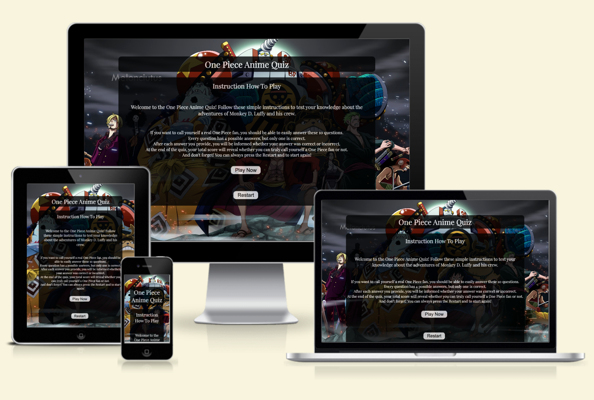
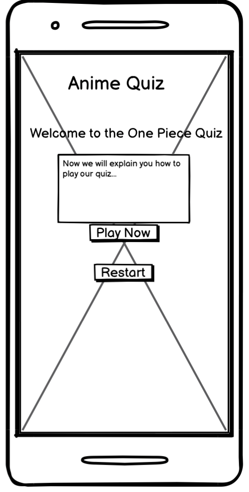
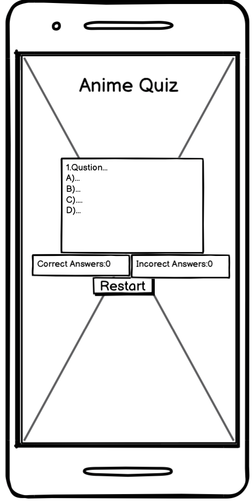
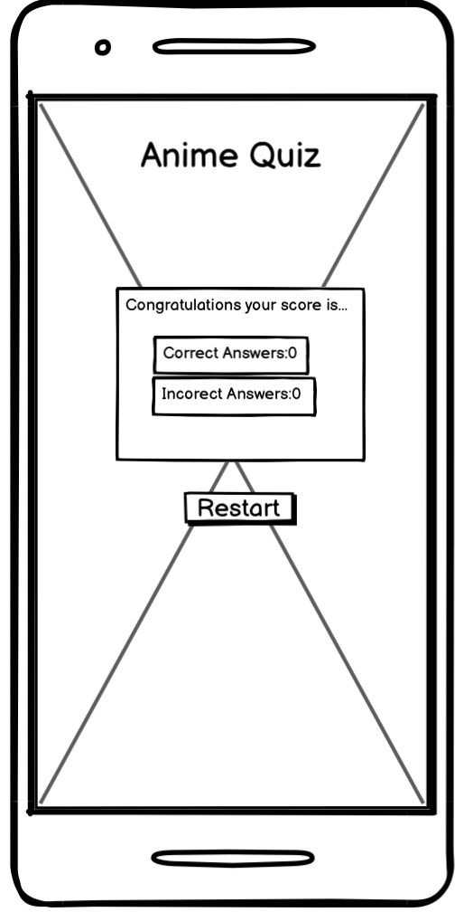
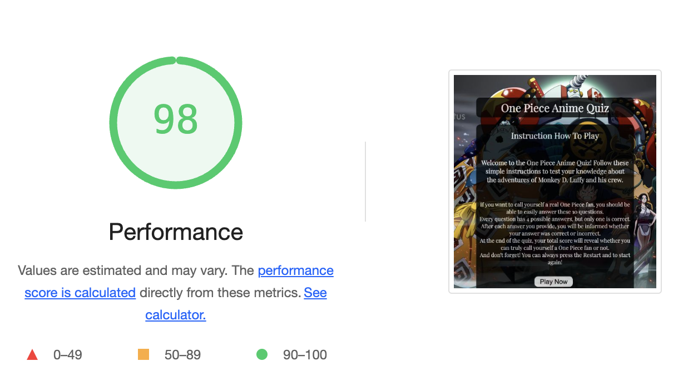
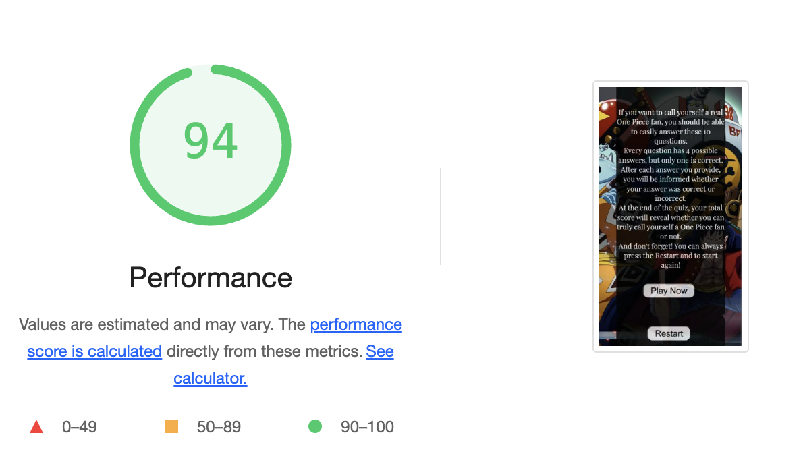

# One Piece Anime Quiz
Welcome to [One Piece Anime Quiz](https://ivost98.github.io/anime-one-piece-quiz/).

The project is a web-based quiz application designed to evaluate users' knowledge of the popular anime series "One Piece." The application presents a sequence of multiple-choice questions focused on the adventures of Monkey D. Luffy and his crew. The goal is to challenge the users' recall and comprehension of the series' content.

## Table of Contents
* [User Stories](#user-stories)
* [Features](#features)
* [Future Features](#future-features)
* [Typography and Color Scheme](#typography-and-color-scheme)
  + [Typography](#typography)
  + [Color Scheme](#color-scheme)
* [Wireframes](#wireframes)
* [Technology Used](#technology-used)
* [Testing](#testing)
   + [Code Validation](#code-validation)
   + [Bugs](#bugs)
   + [Further Testing](#further-testing)
   + [Testing the site pages](#testing-the-site-pages)
* [Deployment](#deployment)
   + [Deployment Steps](#deployment-steps)
   + [Forking the GitHub Repository](#forking-the-github-repository)
   + [Making a Local Clone](#making-a-local-clone)
* [Credits](#credits)
   + [Content](#content)
   + [Media](#media)

 ## User Stories

* As user, I want to test my knowledge of "One Piece" so that I can see how much I remember about the series. Specifically, I want to be quizzed on key plot points, character developments, and significant events from the series to ensure I have a deep understanding of the anime's storyline.

* As a user, I want immediate feedback on my answers so that I can learn from my mistakes. When I answer a question, I want to know right away if my answer was correct or incorrect.

* As a user, I want the quiz to be responsive so that I can take it on any device, whether it's my phone, tablet, or computer. This includes ensuring that the layout adjusts smoothly to different screen sizes and that all interactive elements (like buttons and text fields) are easily usable on both touchscreens and traditional displays.

 ## Features

 ## Future Features

 ## Typography and Color Scheme

 ### Typography

 ### Color Scheme

 ## Wireframes

In the planning stage to be created a wireframes were used an app called Balsamiq, which you can find in the next section- `Technology Used` .

When the user open the website:

When the user start to play the quiz:

When the user finish with the quiz:

 ## Technology Used

 + [HTML5](https://de.wikipedia.org/wiki/HTML5) and [CSS3](https://de.wikipedia.org/wiki/Cascading_Style_Sheets) were employed for code development.
 + [Jave Script](https://simple.wikipedia.org/wiki/JavaScript) for interactabilty and logic to wesbite.
 + [Google Fonts](https://fonts.google.com/) to style the text elements.
 + [Git](https://git-scm.com/) facilitated version control, with [Git Hub](https://github.com/) serving as the repository.
 + [Balsamiq](https://balsamiq.com/) aided in creating wireframes for project visualization.
 + [Chrome Developer Tools](https://developer.chrome.com/docs/devtools) to view screen responsiveness on different screens and tools to test website.

 ## Testing

### Code Validation

* The code was tested with [W3C Markup Validator](https://validator.w3.org/) and it was found a 1 warning.
* [Click here to see the Result without bugs or warnings](https://validator.w3.org/nu/?doc=https%3A%2F%2Fivost98.github.io%2Fanime-one-piece-quiz%2F)
* The code was tested with [W3C CSS Validator](https://jigsaw.w3.org/css-validator/#validate_by_input) without any bugs [Result](https://jigsaw.w3.org/css-validator/validator?uri=https%3A%2F%2Fivost98.github.io%2Fanime-one-piece-quiz%2F&profile=css3svg&usermedium=all&warning=1&vextwarning=&lang=en)
* After [JSHint Validator](https://jshint.com/) were found that there has two undefined variables and missing semicolon. Without any
significant bugs. The problems are fixed and it can be seen in [Bugs](#bugs)
  + There are 7 functions in this file.
  + Function with the largest signature take 1 arguments, while the median is 0.
  + Largest function has 7 statements in it, while the median is 5.
  + The most complex function has a cyclomatic complexity value of 2 while the median is 1.

### Bugs

* The warning after [W3C Markup Validator](https://validator.w3.org/) was that - `Section lacks heading. Consider using h2-h6 elements to add identifying headings to all sections, or else use a div element instead for any cases where no heading is needed`. 
* After [W3C Markup Validator](https://validator.w3.org/) you can find the code [here](https://github.com/IvoSt98/anime-one-piece-quiz/commit/65d1fa209420c08aad57c8145e03d0b8afae4a5f) and how was fixed.
* After [JSHint Validator](https://jshint.com/) you can find the code [here](https://github.com/IvoSt98/anime-one-piece-quiz/commit/c1742081716b00f7b8d88419ee4572049857c6b2) and how was fixed.

### Further Testing

1. Extensive browser testing was conducted across:
+ Google Chrome
+ Internet Explorer
+ Opera
+ Microsoft Edge
+ Safari.
2. The website has been tested on the following devices:
+ IPhone 12 Pro
+ IPhone 14 Pro Max
+ IPad pro
+ Asus Zenbook Duo
3. Feedback from friends and family members was sought to identify any bugs or user experience issues.

+ Lighthouse testing on dekstop screens:

+ Lighthouse testing on mobile screens:

### Testing the site pages

| Feature | Test steps | Expectation | Result |
|-----    |----------    |----------   |--------|
| First loading of the page |1. Open the website URL. 2. Observe the elements displayed on the page.| The header, instruction section, and buttons are displayed correctly. | Pass |
| Play Now Onclick | 1. Click the 'Play Now' button. 2. Observe the changes on the screen.| Instructions section is hidden, first question and answer buttons appear, and the score area is visible. | Pass |
| Answer Buttons Onclick | 1. Click one of the answer buttons. 2. Observe the score area.| Score area updates with correct or incorrect answer count. And after that shows next question with possible answers. | Pass |
| When the game ends | 1. Answer all questions in the quiz. 2. Observe the final screen.| Instruction section and questions are hidden, and a congratulatory message with score details appears.| Pass |
| Restart Button Onclick | 1. Click the 'Restart' button at any time. 2. Observe the changes on the screen. |Score resets to zero, and the main instructions section is displayed. | Pass |

#### Expaining:
1. First Loading of the Page

 Description: Verify the initial state of the homepage when the website is first loaded.
+ Open the website [One Piece Anime Quiz](https://ivost98.github.io/anime-one-piece-quiz/).
+ Check if the header, instruction section, and buttons ('Play' and 'Restart') are visible.
+ Expected Result: The header, instruction section, and 'Play' and 'Restart' buttons should be visible.
+ Status: Pass

2. 'Play Now' OnClick

 Description: Test the functionality of the 'Play Now' button to start the quiz.
+ Click the 'Play Now' button.
+ Verify if the instructions section is hidden and the quiz questions appear.
+ Expected Result: Instructions section should be hidden, and the first question with answer buttons and score area should be displayed.
+ Status: Pass

3. Answer Buttons OnClick

Description: Ensure that clicking an answer button updates the score area.
+ Click one of the answer buttons.
+ Observe the score area for updates.
+ Expected Result: The score area should update with the correct or incorrect answer count.
+ Status: 

About correct score:

About incorrect score:

4. When the Game Ends

Description: Verify the behavior when all quiz questions are answered.
+ Answer all the questions in the quiz.
+ Observe the final screen after the last question.
+ Expected Result: Instruction section and questions should be hidden, and a congratulatory message with the user's score should be displayed.
+ Status: Pass

5. 'Restart' Button OnClick

Description: Test the functionality of the 'Restart' button to reset the quiz.
+ Click the 'Restart' button at any point during the quiz.
+ Observe the changes on the screen.
+ Expected Result: The score should reset to zero, and the main instructions section should be displayed.
+ Status: Pass

6. Conclusion

All tested features of the [One Piece Anime Quiz Website](https://ivost98.github.io/anime-one-piece-quiz/). function as expected. The website provides a smooth and engaging user experience, with all key functionalities working correctly. Future tests should include additional scenarios as new features are implemented

## Deployment

### Deployment Steps

The project was deployed to GitHub Pages using the following steps...

1. Log in to GitHub and locate the [GitHub Repository](https://github.com/IvoSt98/anime-one-piece-quiz?tab=readme-ov-file#future-features)
2. At the top of the Repository (not the top of the page), locate the "Settings" Button on the menu.
-Alternatively, Click [Here](https://github.com/IvoSt98/anime-one-piece-quiz/settings) for a GIF demonstrating the process starting from Step 2.
3. Scroll down the Settings page until you locate the "GitHub Pages" Section.
4. Under "Source", click the dropdown called "None" and select "Master Branch".
5. The page will automatically refresh.
6. Scroll back down through the page to locate the now published site [link](https://github.com/IvoSt98/anime-one-piece-quiz?tab=readme-ov-file#future-features) in the "GitHub Pages" section, it will be under the name Deployments.

### Forking the GitHub Repository

By forking the GitHub Repository we make a copy of the original repository on our GitHub account to view and/or make changes without affecting the original repository by using the following steps...

1. Log in to GitHub and locate the GitHub Repository
2. At the top of the [Repository](https://github.com/IvoSt98/anime-one-piece-quiz?tab=readme-ov-file#future-features) between the Watch and Star buttons on the menu, is the "Fork" Button.
3. You should now have a copy of the original repository in your GitHub account.

### Making a Local Clone

 To clone this repository, follow these steps:

1. On the repository's GitHub page, click on the Code button.
2. In the dropdown, click on Clone to copy the repository's URL to your clipboard.
3. Open your terminal.
4. Go to the directory where you want to clone the repository.
5. Use the `git clone` command followed by the URL you copied, then hit ENTER.
6. Done, cloned to your local machine!

## Credits

### Content
+ The idea for the score section is from [Love Maths Project](https://github.com/Code-Institute-Solutions/love-maths-2.0-sourcecode/blob/master/01-putting-the-basics-in-place/02-writing-some-html-part1/index.html)
+ Guidense about Java Script code are from [Code Institute](https://codeinstitute.net/de/bildungsgutschein/?utm_term=code%20institute&utm_campaign=CI+-+UK+-+Search+-+Brand&utm_source=adwords&utm_medium=ppc&hsa_acc=8983321581&hsa_cam=16493764737&hsa_grp=132915436966&hsa_ad=635790877675&hsa_src=g&hsa_tgt=kwd-319867646331&hsa_kw=code%20institute&hsa_mt=e&hsa_net=adwords&hsa_ver=3&gad_source=1&gclid=CjwKCAjw-O6zBhASEiwAOHeGxUZA9Vmia-upw7RdcmqjkSctoFqm75GZYhMuyr6GjIB2UdizcDwlnxoCHLgQAvD_BwE), [Stack Overflow](https://stackoverflow.com/), [W3Schools](https://www.w3schools.com/)
+ Font utilized in this website is from [Google Fonts](https://fonts.google.com/).

### Media
+ Background image was taken from [Alpha Coders ](https://wall.alphacoders.com/big.php?i=1099923)