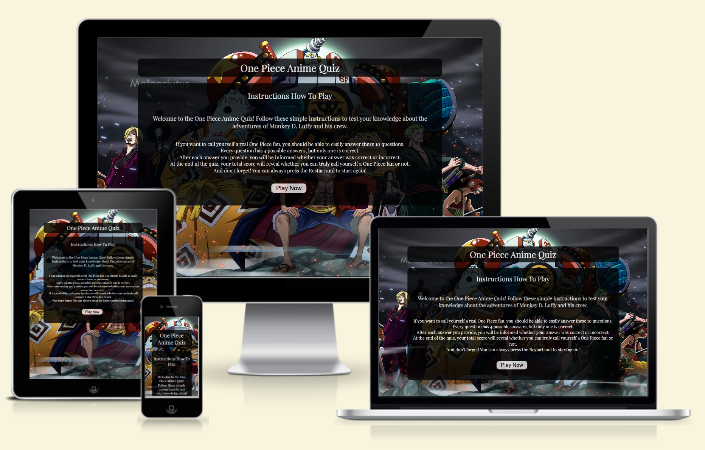
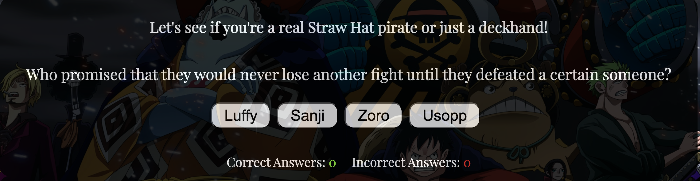
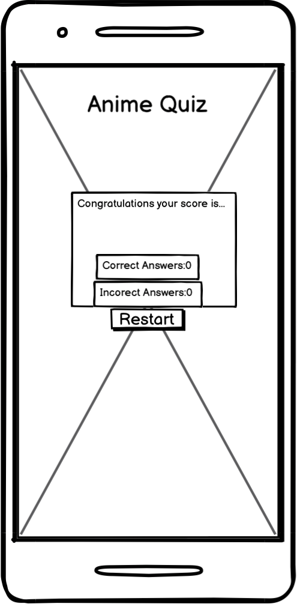
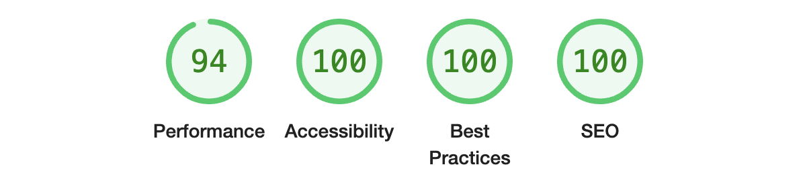

# One Piece Anime Quiz
Welcome to the [One Piece Anime Quiz](https://ivost98.github.io/anime-one-piece-quiz/).

The project is a web-based quiz application designed to evaluate users' knowledge of the popular anime series "One Piece." The application presents a sequence of multiple-choice questions focused on the adventures of Monkey D. Luffy and his crew. The goal is to challenge the users' recall and comprehension of the series' content.

## Table of Contents
* [User Stories](#user-stories)
* [Features](#features)
* [Future Features](#future-features)
* [Typography and Color Scheme](#typography-and-color-scheme)
  + [Typography](#typography)
  + [Color Scheme](#color-scheme)
* [Wireframes](#wireframes)
* [Technology Used](#technology-used)
* [Testing](#testing)
   + [Code Validation](#code-validation)
   + [Bugs](#bugs)
   + [Further Testing](#further-testing)
   + [Testing the site pages](#testing-the-site-pages)
* [Deployment](#deployment)
   + [Deployment Steps](#deployment-steps)
   + [Forking the GitHub Repository](#forking-the-github-repository)
   + [Making a Local Clone](#making-a-local-clone)
* [Credits](#credits)
   + [Content](#content)
   + [Media](#media)

 ## User Stories

* As a user, I want to test my knowledge of "One Piece" to see how much I remember about the series. Specifically, I want to be quizzed on key plot points, character developments, and significant events from the series to ensure I have a deep understanding of the anime's storyline.

* As a user, I want immediate feedback on my answers so that I can learn from my mistakes. When I answer a question, I want to know immediately if my answer is correct or incorrect.

* As a user, I want the quiz to be responsive so that I can take it on any device, whether my phone, tablet, or computer. This includes ensuring that the layout adjusts smoothly to different screen sizes and that all interactive elements (like buttons and text fields) are easily usable on touchscreens and traditional displays.

 ## Features
**Our Header**

+ The header displays the quiz's name at the top of the screen. 
+ It remains fixed in position throughout the game, serving as a constant reminder to the user of the quiz they are participating in.

 

 **Our Instructions Section**

 The section is meticulously structured to enhance user engagement and clarity:

1. Our H2 Element:

+ The section begins with an H2 element, serving as a concise introduction that outlines the overarching theme and objectives of the quiz.

2. Introduction Message:

+ A warm greeting message follows, providing a comprehensive explanation of the quiz's purpose. It details the specific skills, knowledge areas, or themes that the quiz will test, ensuring users understand the context and relevance of their participation.

3. Gameplay Instructions:

+ Detailed instructions are presented to guide users through the quiz experience:
    + Button Navigation: Clear directions on which buttons to click for specific actions, such as starting the quiz, navigating between questions, and submitting answers.
    + Response Feedback: Explanation of how the system provides feedback on answers—distinguishing between correct and incorrect responses. This includes visual cues or messages that indicate success or areas for improvement.

4.  Button Play Now:

+ Positioned strategically after the instructional segment, a prominent "PLAY NOW" button awaits user interaction.
+ Functionality: Clicking this button seamlessly transitions users to the quiz section. Simultaneously, it conceals the instruction portion to streamline the interface and focus user attention on the interactive quiz content.

 

 **Our Play Section**

After the user presses the "PLAY NOW" button and the instruction section is hidden, a new section appears presenting the quiz questions and answers:

1. Motivational Message:
+ The section begins with a brief motivational message aimed at engaging the user and sparking their interest in the quiz.
Which will be visible until the end of the quiz.

2. First Question:
+ The initial quiz question is prominently displayed under the motivational message.

3. Possible Answers:
+ Four possible answers are given below the question. Depending on the answer type (true/false), the score indicator will be updated for correct and incorrect answers.

4. Navigation to Next Question:
+ Upon selecting an answer, the user is automatically directed to the subsequent question along with its set of possible answers.

5. Score Tracking:
+ The user's score updates dynamically based on their responses. The interface displays the number of correct and incorrect answers as the quiz progresses, providing real-time feedback on performance.

 

 **Our End Game Section**

After the user answers all the quiz questions, the question and answer section is hidden, and a new End Game section appears:

1. Quiz Completion Message:
+ The section begins with a concise message indicating that the quiz has ended, providing clarity to the user.

2. Performance Evaluation:
+ A small message follows, indicating whether the user is characterized as a "true fan" or not based on their number of correct and incorrect answers.

3. Review of Answers:
+ The user is presented with a summary of their correct and incorrect answers. This allows them to assess their knowledge and determine their level of familiarity with the quiz content.

 

 **Our Footer**

 The quiz interface footer features a prominently displayed "Restart" button designed to offer users the ability to reset the quiz and initiate a new session at their discretion. Here’s how it operates:

 + The "Restart" button becomes visible after the "PLAY" button is pressed and remains visible until the quiz ends. When the "Restart" button is clicked, a modal box appears to confirm the user's intent to restart the quiz, preventing accidental restarts.

 + The button is strategically positioned within the footer for easy access and is visually distinct to ensure users can locate it effortlessly without disrupting gameplay.

 

 + Its primary function is to reset all quiz elements and settings to their initial state. This includes clearing user progress, scores, or any changes made during the previous gameplay session.

 + The modal box initially displays a small message to attract the user's attention. This is followed by a concise question to ensure the user truly wants to restart the quiz The modal then presents two buttons: one to confirm the restart and another to continue the quiz.

 

 ## Future Features

1. **Quiz Difficulty Levels**: Implement a section to select quiz difficulty (easy, medium, hard) to cater to various knowledge levels.
2. **Enhanced Answer Feedback**: Improve the color feedback system by displaying answers in red or green to indicate correctness immediately.
3. **End-of-Game Feedback**: Enhance the post-game section with more detailed text, providing feedback on whether the player is a true fan based on their performance.
4. **Dynamic Timer**: Introduce a timer feature that adjusts based on the selected difficulty level, providing an appropriate challenge for each level.
5. **Subscription Feature**: Add a subscription section where users can opt-in to receive notifications about future quizzes.

 ## Typography and Color Scheme

 ### Typography

The font chosen for this project is **Playfair Display**, a serif typeface. This selection has been made to ensure consistency and enhance readability throughout the entire application. 

Key reasons for choosing Playfair Display:
- **Consistency**: The serif style aligns with the overall design aesthetic of the project, providing a cohesive look and feel.
- **Readability**: Playfair Display is designed to be highly readable, making it suitable for various screen sizes and resolutions.
- **Elegance**: The serif design adds a touch of elegance, which complements the project's visual identity.

By using Playfair Display, we aim to deliver a visually appealing and user-friendly experience.

 ### Color Scheme

+ The white text is used to ensure high visibility against the black background. The black background is slightly blurred to allow the background image to remain visible while maintaining the readability of the white text.

+ For correct and incorrect answers, corresponding colors have been added: green for correct answers and red for incorrect answers. For the pop-up box, different shades of red and green were used to complement the white background.

This is the color scheme with all colors used in the project!

 ## Wireframes

In the planning stage to create wireframes, an app called Balsamiq, which you can find in the next section - `Technology Used`.

When the user opens the website:

When the user starts to play the quiz:

When the user clicks to restart the quiz:

When the user finishes with the quiz:

 ## Technology Used

 + [HTML5](https://de.wikipedia.org/wiki/HTML5) and [CSS3](https://de.wikipedia.org/wiki/Cascading_Style_Sheets) were employed for code development.
 + [Java Script](https://simple.wikipedia.org/wiki/JavaScript) for interactivity and logic of the website.
 + [Google Fonts](https://fonts.google.com/) to style the text elements.
 + [Git](https://git-scm.com/) facilitated version control, with [Git Hub](https://github.com/) serving as the repository.
 + [Balsamiq](https://balsamiq.com/) aided in creating wireframes for project visualization.
 + [Chrome Developer Tools](https://developer.chrome.com/docs/devtools) to view screen responsiveness on different screens and tools to test the  website.
 + [Adobe Color Wheel](https://color.adobe.com/create/color-wheel) was used for the color scheme in the project.

 ## Testing

### Code Validation

* The code was tested with [W3C Markup Validator](https://validator.w3.org/) and it was found a warning and a bug.
* [Click here to see the Result without bugs or warnings](https://validator.w3.org/nu/?doc=https%3A%2F%2Fivost98.github.io%2Fanime-one-piece-quiz%2F).
* The code was tested with [W3C CSS Validator](https://jigsaw.w3.org/css-validator/#validate_by_input) without any bugs [Result](https://jigsaw.w3.org/css-validator/validator?uri=https%3A%2F%2Fivost98.github.io%2Fanime-one-piece-quiz%2F&profile=css3svg&usermedium=all&warning=1&vextwarning=&lang=en).
* After the [JSHint Validator](https://jshint.com/) was found that there were two undefined variables and missing semicolons. Without any
significant bugs. The problems are fixed and it can be seen in [Bugs](#bugs).
  + There are 10 functions in this file.
  + Function with the largest signature take 1 arguments, while the median is 0.
  + Largest function has 9 statements in it, while the median is 4.5.
  + The most complex function has a cyclomatic complexity value of 2 while the median is 1.

### Bugs
1. After [W3C Markup Validator](https://validator.w3.org/).
* The warning after the [W3C Markup Validator](https://validator.w3.org/) was that - `Section lacks heading. Consider using h2-h6 elements to add identifying headings to all sections, or else use a div element instead for any cases where no heading is needed`. 
* The warning you can find [here](https://github.com/IvoSt98/anime-one-piece-quiz/commit/65d1fa209420c08aad57c8145e03d0b8afae4a5f) and how was fixed.
* The [bug](https://github.com/IvoSt98/anime-one-piece-quiz/commit/25f51c8edbd5e8890762c07fc3e2ffec0f99f641) was because the ul tag was in the wrong place, the bug was fixed.

2. After [JSHint Validator](https://jshint.com/).
* After [JSHint Validator](https://jshint.com/) you can find the code [here](https://github.com/IvoSt98/anime-one-piece-quiz/commit/c1742081716b00f7b8d88419ee4572049857c6b2) and how was fixed.

### Further Testing

1. Extensive browser testing was conducted across:
+ Google Chrome
+ Internet Explorer
+ Opera
+ Microsoft Edge
+ Safari.
2. The website has been tested on the following devices:
+ iPhone 12 Pro
+ iPhone 14 Pro Max
+ IPad pro
+ Galaxy Z Fold 5
+ Samsung Galaxy A51/71
+ Asus Zenbook Duo
3. Feedback from friends and family members was sought to identify any bugs or user experience issues.

+ Lighthouse testing on desktop screens:

+ Lighthouse testing on mobile screens:

### Testing the site pages

| Feature | Test steps | Expectation | Result |
|-----    |----------    |----------   |--------|
| First loading of the page |1. Open the website URL. 2. Observe the elements displayed on the page.| The header, instruction section, and the button PLAY are displayed correctly. | Pass |
| Play Now Onclick | 1. Click the 'Play Now' button. 2. Observe the changes on the screen.| The instructions section is hidden, the first question and answer buttons appear, the scoring area is visible and the RESTART button shows up correctly. | Pass |
| Answer Buttons Onclick | 1. Click one of the answer buttons. 2. Observe the score area.| Score area updates with correct or incorrect answer count. After that show the next question with possible answers. The RESTART button continues to stay until the end of the quiz. | Pass |
| When the game ends | 1. Answer all questions in the quiz. 2. Observe the final screen.| The instruction section and questions are hidden, and a congratulatory message with score details appears. Under the section, the RESTART button still stays in position.| Pass |
| Restart Button Onclick | 1. Click the 'Restart' button at any time. 2. Observe the changes on the screen. |When the RESTART button is clicked, a confirmation modal box is triggered to appear. The modal box initiates with an appropriate image, followed by a warning message and a question, accompanied by 'Yes, I would like.' and 'No, continue.' buttons. Upon pressing the 'Yes, i would like.' button, the entire questionnaire resets, starting from the beginning. Pressing the 'No,countinue.' button closes the modal box and the quiz resumes its current state. | Pass |

#### Explaining:
1. First Loading of the Page

 Description: Verify the initial state of the homepage when the website is first loaded.
+ Open the website [One Piece Anime Quiz](https://ivost98.github.io/anime-one-piece-quiz/).
+ Check if the header, instruction section, and buttons ('Play' and 'Restart') are visible.
+ Expected Result: The header, instruction section, and 'Play' and 'Restart' buttons should be visible.
+ Status: Pass

2. 'Play Now' OnClick

 Description: Test the functionality of the 'Play Now' button to start the quiz.
+ Click the 'Play Now' button.
+ Verify if the instructions section is hidden and the quiz questions appear.
+ Expected Result: The instructions section should be hidden, the first question with answer buttons, the scoring area should be displayed and the RESTART button should show up correctly.
+ Status: Pass

3. Answer Buttons OnClick

Description: Ensure that clicking an answer button updates the scoring  area.
+ Click one of the answer buttons.
+ Observe the score area for updates.
+ Expected Result: The score area should update with the correct or incorrect answer count. The RESTART button continues to stay until the end of the quiz.
+ Status: Pass

About the correct score:

About the incorrect score:

4. When the Game Ends

Description: Verify the behavior when all quiz questions are answered.
+ Answer all the questions in the quiz.
+ Observe the final screen after the last question.
+ Expected Result: The instruction section and questions are hidden, and a congratulatory message with score details appears. Under the section, the RESTART button still stays in position.
+ Status: Pass

5. 'Restart' Button OnClick

Description: Test the functionality of the 'Restart' button to reset the quiz.
+ Click the 'Restart' button at any point during the quiz.
+ Observe the changes on the screen.
+ Expected Result: When the RESTART button is clicked, a confirmation modal box is triggered to appear. The modal box initiates with an appropriate image, followed by a warning message and a question, accompanied by 'Yes, i would like.' and 'No, continue.' buttons. Upon pressing the 'Yes, I would like.' button, the entire questionnaire resets, starting from the beginning. Pressing the 'No,countinue.' button closes the modal box and the quiz resumes from its current state."
+ Status: Pass

After the button "Yes, I would like" is clicked:

After the button "No, continue." is clicked:

6. Conclusion

All tested features of the [One Piece Anime Quiz Website](https://ivost98.github.io/anime-one-piece-quiz/). Function as expected. The website provides a smooth and engaging user experience, with all key functionalities working correctly. Future tests should include additional scenarios as new features are implemented.

## Deployment

### Deployment Steps

The project was deployed to GitHub Pages using the following steps...

Before the deployment of the project:
1. With the command `git add.`, all at the command line prompt in your local project directory to add the files or changes to the repository.
2. After, the command `git commit -m` permanently stores the contents of the index in the local repository.
3. In the end, `git push` is used - to upload local repository content to a remote repository.

Deployment of the project:
1. Log in to GitHub and locate the [GitHub Repository](https://github.com/IvoSt98/anime-one-piece-quiz?tab=readme-ov-file#future-features)
2. At the top of the Repository (not the top of the page), locate the "Settings" Button on the menu.
-Alternatively, Click [Here](https://github.com/IvoSt98/anime-one-piece-quiz/settings) for a GIF demonstrating the process starting from Step 2.
3. Scroll down the Settings page until you locate the "GitHub Pages" Section.
4. Under "Source", click the dropdown called "None" and select "Master Branch".
5. The page will automatically refresh.
6. Scroll back down through the page to locate the now published site [link](https://github.com/IvoSt98/anime-one-piece-quiz?tab=readme-ov-file#future-features) in the "GitHub Pages" section, it will be under the name Deployments.

### Forking the GitHub Repository

By forking the GitHub Repository we make a copy of the original repository on our GitHub account to view and/or make changes without affecting the original repository by using the following steps...

1. Log in to GitHub and locate the GitHub Repository
2. At the top of the [Repository](https://github.com/IvoSt98/anime-one-piece-quiz?tab=readme-ov-file#future-features) between the Watch and Star buttons on the menu, is the "Fork" Button.
3. You should now have a copy of the original repository in your GitHub account.

### Making a Local Clone

 To clone this repository, follow these steps:

1. On the repository's GitHub page, click on the Code button.
2. In the dropdown, click on Clone to copy the repository's URL to your clipboard.
3. Open your terminal.
4. Go to the directory where you want to clone the repository.
5. Use the `git clone` command followed by the URL you copied, then hit ENTER.
6. Done, cloned to your local machine!

## Credits

### Content
+ The idea for the score section is from [Love Maths Project](https://github.com/Code-Institute-Solutions/love-maths-2.0-sourcecode/blob/master/01-putting-the-basics-in-place/02-writing-some-html-part1/index.html).
+ Guidance about Java Script code is from [Code Institute](https://codeinstitute.net/de/bildungsgutschein/?utm_term=code%20institute&utm_campaign=CI+-+UK+-+Search+-+Brand&utm_source=adwords&utm_medium=ppc&hsa_acc=8983321581&hsa_cam=16493764737&hsa_grp=132915436966&hsa_ad=635790877675&hsa_src=g&hsa_tgt=kwd-319867646331&hsa_kw=code%20institute&hsa_mt=e&hsa_net=adwords&hsa_ver=3&gad_source=1&gclid=CjwKCAjw-O6zBhASEiwAOHeGxUZA9Vmia-upw7RdcmqjkSctoFqm75GZYhMuyr6GjIB2UdizcDwlnxoCHLgQAvD_BwE), [Stack Overflow](https://stackoverflow.com/), [ and W3Schools](https://www.w3schools.com/).
+ The idea and part of the code for the Modal Box were seen and taken from [W3Schools](https://www.w3schools.com/howto/howto_css_modals.asp).
+ The font utilized in this website is from [Google Fonts](https://fonts.google.com/).

### Media
+ The background image was taken from [Alpha Coders](https://wall.alphacoders.com/big.php?i=1099923).
+ The Pop-Up image when the Restart button is clicked is taken from [Pinterest DEIVISCC on DeviantArt](https://www.pinterest.com/pin/691021136561159205/).